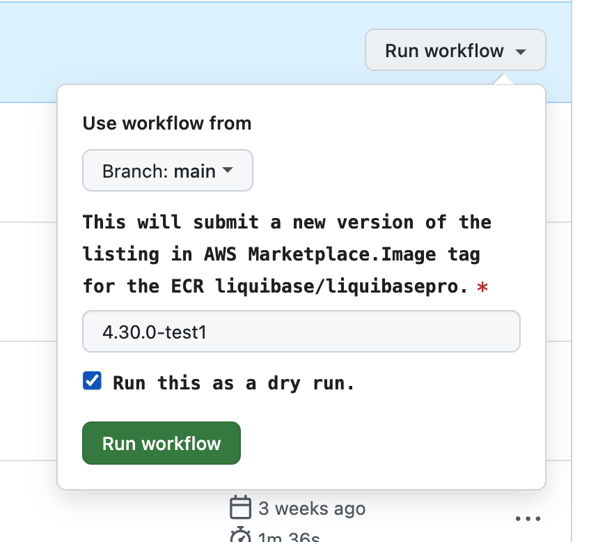

# Liquibase AWS Marketplace Extension Deployment and Testing Process

🚀 Deploying a test extension to AWS Marketplace

1. Check for Update the versions: make sure the latest liquibase-secure.version is set in both **pom.xml** and **Dockerfile** before submitting an AWS Marketplace version. Check for any dependabot PR's to be merged.

2. Steps that happen for every SECURE release:

a. dependabot.yml checks for new Docker dependencies and liquibase-secure.version updates, creating PRs when new versions are released.

b. dependabot-pr-merge-docker-changes.yml automatically merges Dependabot PRs for both Docker OSS version updates and liquibase-secure.version changes.

c. Once the Liquibase Secure Docker image is published (from this workflow https://github.com/liquibase/docker/blob/main/.github/workflows/create-release.yml#L546) you must manually trigger deploy-extension-to-marketplace.yml in dry_run mode. This publishes a test image to the AWS Marketplace.

d. After AWS Marketplace approval, QA runs the run-task-definitions.yml workflow using the test image. If there are no errors, the test image will be restricted automatically as part of the workflow.

e. QA then manually runs deploy-extension-to-marketplace.yml again (this time not in dry run). This submits the actual Liquibase-Pro version to the Marketplace.

# :crystal_ball: Run Task definitions

1. NOTE: it is going to take a while for the new version to be approved. Approximate 30mins.
2. Run the workflow file `run-task-definitions.yml` with the test image tag
   
3. After the workflow is successfully run, the `test_tag` version should be restricted as part of the workflow.NOTE: it is going to take a while for the version to be restricted. Approximate 15mins.

# :ship: Deploy the actual listing after testing

1.**After testing** run the workflow [deploy-extension-to-marketplace.yml](https://github.com/liquibase/liquibase-aws-license-service/blob/main/.github/workflows/deploy-extension-to-marketplace.yml) with actual value eg: `4.31.0` with **disabled** "Run this as dry run"

# :hammer: Manually test liquibase commands with the Marketplace listing

1. We have a `LiquibaseAWSMP` AWS account where we have listed the extension in the AWS Marketplace.
2. All the QA's and Dev's should have access to this account.
3. We have AWS Fargate Cluster called `aws-mp-test-cluster` setup in this account where we can run the Liquibase commands.
4. Most of the liquibase commands should already be defined under `Task Definitions` section in the ECS Cluster.
5. All you do is navigate to `Tasks` tab, `Run New Task`, under `Family` select the task definition you want to run, and then click on `Create`.

   

   

6. You can also run the task using the `aws-cli` command.
   ```bash
   aws ecs run-task --cluster aws-mp-test-cluster --task-definition update-liquibase
   ```
7. To check logs of the task, click on the task you just ran under `Tasks` tab. And then navigate to `Logs` tab.

   

   

8. To add more commands to test in the `aws-mp-test-cluster`, you can add them in the `Task Definitions` section.
9. Contact the DevOps team to get access to the `LiquibaseAWSMP` AWS account or any other help required.

# :sparkles: New version of `liquibase-aws-license-service`

1. We release a new version of `liquibase-aws-license-service` only when it is required, as this is a SECURE extension.
2. When there is a new `liquibase-aws-license-service` version release, the dependabot in LPM(liquibase package manager) repository creates a PR: example : https://github.com/liquibase/liquibase-package-manager/pull/430/files#diff-0b0a9d274bd84c7dbfff4680de10599cd0d96458b06b74a925b2bcd3e3fc2fadR15. We need to **manually** merge the PR. Make sure to review and merge the PR before proceeding.