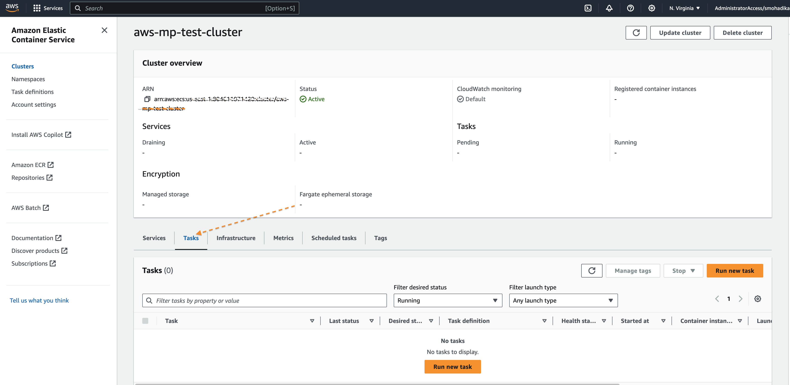
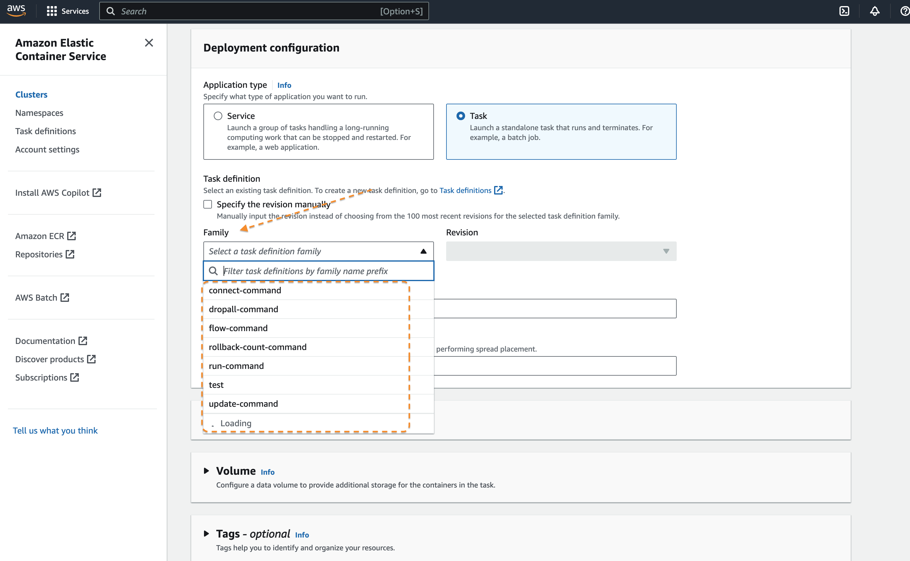
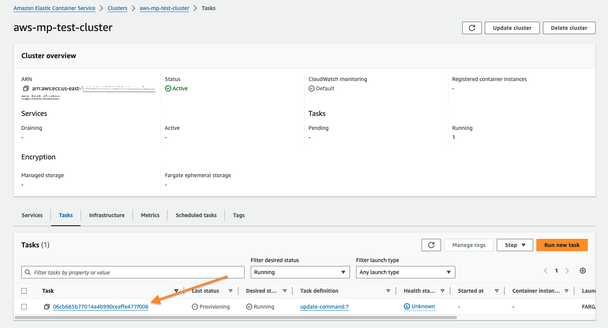
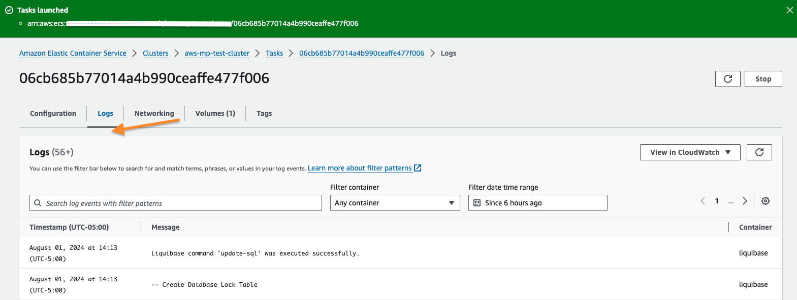

# Liquibase AWS Marketplace Extension Deployment and Testing Process

## 🚀 Deploying a test extension to AWS Marketplace

### Complete Automation Flow

```
┌─────────────────────────────────────────────────────────────┐
│ Dependabot detects liquibase-secure version update          │
│ (e.g., 5.0.1 → 5.0.2)                                       │
└────────────────────────┬────────────────────────────────────┘
                         │
                         ↓
┌─────────────────────────────────────────────────────────────┐
│ dependabot-sync-and-merge.yml                               │
│ - Syncs Dockerfile + pom.xml versions                       │
│ - Auto-merges PR to main                                    │
│ - Triggers auto-trigger-marketplace-deployment.yml          │
│   for liquibase-secure updates (via workflow_dispatch        │
│   with version passed as input)                              │
└────────────────────────┬────────────────────────────────────┘
                         │
                         ↓
┌─────────────────────────────────────────────────────────────┐
│ auto-trigger-marketplace-deployment.yml                     │
│ - Triggered by: push to main OR workflow_dispatch from      │
│   dependabot-sync-and-merge.yml (with version input)        │
│ - Detects version change via input or git diff fallback     │
│ - Generates test tag: test-<liquibase-secure.version>       │
│ - Triggers deploy workflow                                  │
└────────────────────────┬────────────────────────────────────┘
                         │
                         ↓
┌───────────────────────────────────────────────────────────────┐
│ deploy-extension-to-marketplace.yml (dry_run=true)            │
│ - Builds Docker image with new version                        │
│ - Pushes to AWS Marketplace as test-<liquibase-secure.version>│
│ - Creates change set via AWS API                              │
└────────────────────────┬──────────────────────────────────────┘
                         │
                         ↓
┌─────────────────────────────────────────────────────────────┐
│ AWS Marketplace (~30 min)                                   │
│ - Validates image                                           │
│ - Scans for vulnerabilities                                 │
│ - Change set: PROCESSING → SUCCEEDED                        │
└────────────────────────┬────────────────────────────────────┘
                         │
                         ↓
┌─────────────────────────────────────────────────────────────┐
│ EventBridge Scheduler (every 15 min)                        │
│ - Triggers PollMarketplaceChangeSetStatus Lambda            │
└────────────────────────┬────────────────────────────────────┘
                         │
                         ↓
┌───────────────────────────────────────────────────────────────────────────────┐
│ Lambda: PollMarketplaceChangeSetStatus                                        │
│ - Finds SUCCEEDED change set for test-<liquibase-secure.version>              │
│ - Checks DynamoDB (not processed yet)                                         │
│ - Extracts image tag: test-<liquibase-secure.version>                         │
│ - Calls GitHub API to trigger run-task-definitions.yml                        │
│ - Records in DynamoDB to prevent duplicates                                   │
└────────────────────────┬──────────────────────────────────────────────────────┘
                         │
                         ↓
┌─────────────────────────────────────────────────────────────┐
│ run-task-definitions.yml                                    │
│ - Runs ECS tasks on aws-mp-test-cluster                     |
│ - Tests marketplace image: test-<liquibase-secure.version>  │
│ - If tests pass: Restricts test image from public access    │
│ - Marks test as completed in DynamoDB                       │
└────────────────────────┬────────────────────────────────────┘
                         │
                         ↓
┌─────────────────────────────────────────────────────────────┐
│ Test image restriction processing (~15 min)                 │
│ - AWS processes the restriction change set                  │
│ - Change set status: PROCESSING → SUCCEEDED                 │
└────────────────────────┬────────────────────────────────────┘
                         │
                         ↓
┌───────────────────────────────────────────────────────────────────────────────┐
│ Lambda: PollMarketplaceChangeSetStatus (next 15-min cycle)                    │
│ - Scans DynamoDB for TestStatus=completed                                     │
│ - Finds restriction change set for test image                                 │
│ - Verifies restriction Status=SUCCEEDED                                       │
│ - Triggers deploy-extension-to-marketplace.yml (dry_run=false)                │
│ - Updates DynamoDB: TestStatus=production_released                            │
└────────────────────────┬──────────────────────────────────────────────────────┘
                         │
                         ↓
┌───────────────────────────────────────────────────────────────┐
│ deploy-extension-to-marketplace.yml (dry_run=false)           │
│ - Builds production Docker image (e.g., 5.0.2)                │
│ - Pushes to AWS Marketplace for public release                │
│ - Creates production change set via AWS API                   │
└────────────────────────┬──────────────────────────────────────┘
                         │
                         ↓
┌─────────────────────────────────────────────────────────────┐
│ AWS Marketplace approval (~30 min)                          │
│ - Validates production image                                │
│ - Once approved: Version available to customers             │
└─────────────────────────────────────────────────────────────┘
```

### Workflow Descriptions

#### 1. `dependabot.yml` - Version Monitoring
**What it does:** Automatically monitors for new liquibase-secure Docker images and Maven dependencies daily
**Why needed:** Keeps the extension up-to-date with latest Liquibase Secure versions without manual checking
**Creates:** Separate PRs for Dockerfile and pom.xml updates

#### 2. `dependabot-sync-and-merge.yml` - Version Synchronization
**What it does:** Ensures Dockerfile and pom.xml use the same liquibase-secure version, auto-merges, and triggers marketplace deployment validation for liquibase-secure updates
**Why needed:** Prevents version mismatches between build and runtime; eliminates manual PR merging; ensures deployment pipeline starts reliably
**Without this:** You'd need to manually sync versions, merge two separate PRs, and rely solely on push events to trigger deployment

#### 3. `auto-trigger-marketplace-deployment.yml` - Smart Deployment Trigger
**What it does:** Detects when liquibase-secure version changes in main branch and triggers test deployment
**Why needed:** Automates the testing process immediately after version updates
**Triggered by:** Push to main (Dockerfile/pom.xml changes) or workflow_dispatch from dependabot-sync-and-merge.yml (with version input)
**Concurrency:** Uses a concurrency group to prevent duplicate deployments if both triggers fire simultaneously
**Version detection:** Uses version passed via workflow_dispatch input when available; falls back to git diff for push events. Only triggers when the actual version number changes

#### 4. `deploy-extension-to-marketplace.yml` - Test Image Publisher
**What it does:** Builds Docker image and submits it to AWS Marketplace with test tag (e.g., `test-5.0.2`)
**Why needed:** Creates a test version for validation before production release
**Concurrency:** Uses a concurrency group (`deploy-to-marketplace`) to queue runs instead of running in parallel, preventing duplicate marketplace submissions
**Modes:**
- **dry_run=true**: Test image (auto-restricted after testing)
- **dry_run=false**: Production release (publicly available)

#### 5. AWS EventBridge + Lambda - Approval Detection
**What it does:** Polls AWS Marketplace every 15 minutes to detect when test images are approved
**Why needed:** AWS doesn't send real-time approval notifications; polling ensures we catch approvals
**Components:**
- **EventBridge Scheduler**: Triggers Lambda every 15 minutes
- **Lambda (`PollMarketplaceChangeSetStatus`)**: Checks for SUCCEEDED change sets
- **DynamoDB**: Tracks processed change sets to prevent duplicate test runs

#### 6. `run-task-definitions.yml` - Automated Testing
**What it does:** Runs ECS tasks to test the approved marketplace image, then restricts it and marks as completed
**Why needed:** Validates the image works correctly in AWS Marketplace environment
**After completion:** Marks test as completed in DynamoDB, signaling Lambda to trigger production release
**Important:** Only use for test images (containing `test-` prefix), never production versions

#### 7. Lambda Production Release Trigger (Extended Polling)
**What it does:** Polls for completed tests, verifies restriction succeeded, then triggers production release
**Why needed:** Ensures restriction is complete before submitting production version (AWS doesn't allow simultaneous change sets)
**Process:**
- Scans DynamoDB for `TestStatus = completed`
- Verifies test image restriction change set has `Status = SUCCEEDED`
- Triggers `deploy-extension-to-marketplace.yml` with `dry_run=false`
**Timing:** Triggers within 0-15 minutes after restriction completes

### Automation Timing (Complete End-to-End)

| Phase | Duration | Component |
|-------|----------|-----------|
| Version detection | ~1 day | Dependabot |
| PR sync & merge | ~2 min | GitHub Actions (dependabot-sync-and-merge.yml) |
| Auto-trigger test deploy | ~30 sec | GitHub Actions |
| Deploy test image | ~5 min | GitHub Actions |
| AWS Marketplace test approval | ~30 min | AWS |
| Detection by Lambda polling | 0-15 min | EventBridge + Lambda |
| Run ECS tests | ~10 min | GitHub Actions |
| Restrict test image | ~15 min | AWS Marketplace |
| Lambda detects restriction complete | 0-15 min | EventBridge + Lambda |
| Trigger production release | ~5 sec | Lambda → GitHub API |
| Deploy production image | ~5 min | GitHub Actions |
| AWS Marketplace prod approval | ~30 min | AWS |
| **Total (test to production)** | **~2 hours** | Fully automated |
| **Total (PR merge to public)** | **~2 hours** | Fully automated |

### :hammer: (If required) Manually test liquibase commands with the Marketplace listing

1. We have a `LiquibaseAWSMP` AWS account where we have listed the extension in the AWS Marketplace.
2. All the QA's and Dev's should have access to this account.
3. We have AWS Fargate Cluster called `aws-mp-test-cluster` setup in this account where we can run the Liquibase commands.
4. Most of the liquibase commands should already be defined under `Task Definitions` section in the ECS Cluster.
5. All you do is navigate to `Tasks` tab, `Run New Task`, under `Family` select the task definition you want to run, and then click on `Create`.

   

   

6. You can also run the task using the `aws-cli` command.
   ```bash
   aws ecs run-task --cluster aws-mp-test-cluster --task-definition update-liquibase
   ```
7. To check logs of the task, click on the task you just ran under `Tasks` tab. And then navigate to `Logs` tab.

   

   

8. To add more commands to test in the `aws-mp-test-cluster`, you can add them in the `Task Definitions` section.
9. Contact the DevOps team to get access to the `LiquibaseAWSMP` AWS account or any other help required.

## :sparkles: New version of `liquibase-aws-license-service`

1. We release a new version of `liquibase-aws-license-service` only when it is required, as this is a SECURE extension.
2. When there is a new `liquibase-aws-license-service` version release, the dependabot in LPM(liquibase package manager) repository creates a PR: example : https://github.com/liquibase/liquibase-package-manager/pull/430/files#diff-0b0a9d274bd84c7dbfff4680de10599cd0d96458b06b74a925b2bcd3e3fc2fadR15. We need to **manually** merge the PR. Make sure to review and merge the PR before proceeding.

## Liquibase AWS License Service Extension

This Docker image provides a pre-configured Liquibase Secure environment with the AWS License Service extension installed for use in AWS Marketplace environments.

## 🏗️ Docker Image Architecture

The Dockerfile uses a multi-stage build approach to create a clean, secure final image:

### Builder Stage

- **Base**: `liquibase/liquibase-secure:5.0.0`
- **Purpose**: Install and configure the AWS License Service extension
- **Components**:
  - Downloads and installs Liquibase Package Manager (LPM) v0.2.11
  - Uses LPM to install `liquibase-aws-license-service` extension
  - Supports both AMD64 and ARM64 architectures

### Final Stage  

- **Base**: Clean `liquibase/liquibase-secure:5.0.0` image
- **Purpose**: Provides production-ready Liquibase with AWS extension
- **Contains**: Only the AWS License Service JAR file (no LPM)
- **Security**: Minimal attack surface by excluding build tools

## 🧪 Testing the Docker Image

### Build the Image

```bash
# Build the Docker image
docker build -t liquibase-aws-license-service .
```

### Verify Extension Installation

```bash
# Check that Liquibase loads the AWS extension
docker run --rm liquibase-aws-license-service liquibase --version

# Expected output should include:
# - lib/liquibase-aws-license-service-X.X.X.jar: Liquibase AWS License Service Extension X.X.X By Liquibase
```

### Verify Clean Final Image

```bash
# Confirm LPM is NOT in the final image (should return empty/error)
docker run --rm liquibase-aws-license-service which lpm

# Verify only extension JARs are present
docker run --rm liquibase-aws-license-service ls -la /liquibase/lib/
```

### Test Liquibase Functionality

```bash
# Test basic Liquibase commands
docker run --rm liquibase-aws-license-service liquibase --help

# Test with environment variable for AWS mode
docker run --rm -e DOCKER_AWS_LIQUIBASE=true liquibase-aws-license-service liquibase --help
```

### Interactive Testing

```bash
# Run container interactively for detailed testing
docker run -it --rm liquibase-aws-license-service /bin/bash

# Inside container, test various scenarios:
liquibase --version
env | grep DOCKER_AWS_LIQUIBASE
ls -la /liquibase/lib/
```

## 🎯 Purpose and Benefits

### What This Image Achieves

1. **AWS Marketplace Integration**: Pre-configured for AWS Marketplace licensing
2. **Security**: Clean final image without build tools or package managers
3. **Performance**: Optimized layer caching with multi-stage builds
4. **Compliance**: Ensures only necessary components in production image

### Key Features

- ✅ **AWS License Service Extension**: Pre-installed and ready to use
- ✅ **Multi-Architecture Support**: Works on both AMD64 and ARM64
- ✅ **Secure Build**: Final image contains no build tools or LPM
- ✅ **Environment Markers**: `DOCKER_AWS_LIQUIBASE=true` for identification
- ✅ **Version Pinning**: Uses specific, tested versions of all components

## Automated Version Management

This repository uses Dependabot and GitHub Actions to automatically monitor and update the `liquibase-secure` Docker image version, ensuring that both the Dockerfile and pom.xml stay synchronized.

### 1. How it works

1. **Dependabot monitors** https://github.com/liquibase/docker/pkgs/container/liquibase-secure for new releases (daily)
2. **When a new version is available**, Dependabot creates a PR updating the Dockerfile:
   ```dockerfile
   FROM liquibase/liquibase-secure:X.Y.Z
   ```
3. **Automated workflow** (`dependabot-sync-and-merge.yml`) triggers on the Dependabot PR:
   - Extracts the new version from the Dockerfile
   - Updates `<liquibase-secure.version>` in pom.xml to match
   - Commits the change to the same Dependabot PR
   - Adds a comment showing the version sync
   - Auto-merges the PR after all checks pass

### 2. Configuration Files

- `.github/dependabot.yml` - Configures Dependabot to monitor Docker, Maven, and GitHub Actions
- `.github/workflows/dependabot-sync-and-merge.yml` - Syncs pom.xml version, auto-merges Dependabot PRs, and triggers marketplace deployment for liquibase-secure updates
- `.github/workflows/auto-trigger-marketplace-deployment.yml` - Validates version change and triggers test deployment to AWS Marketplace
