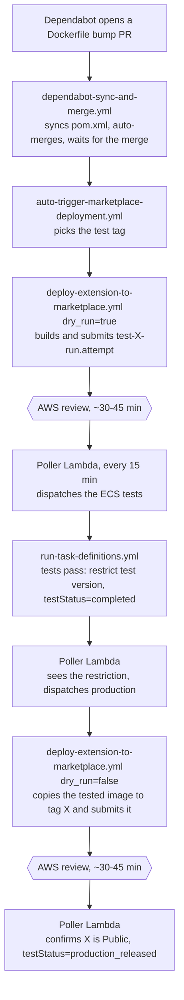
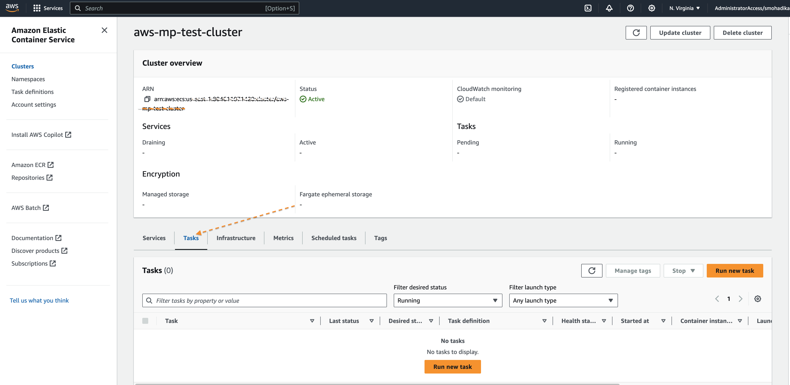
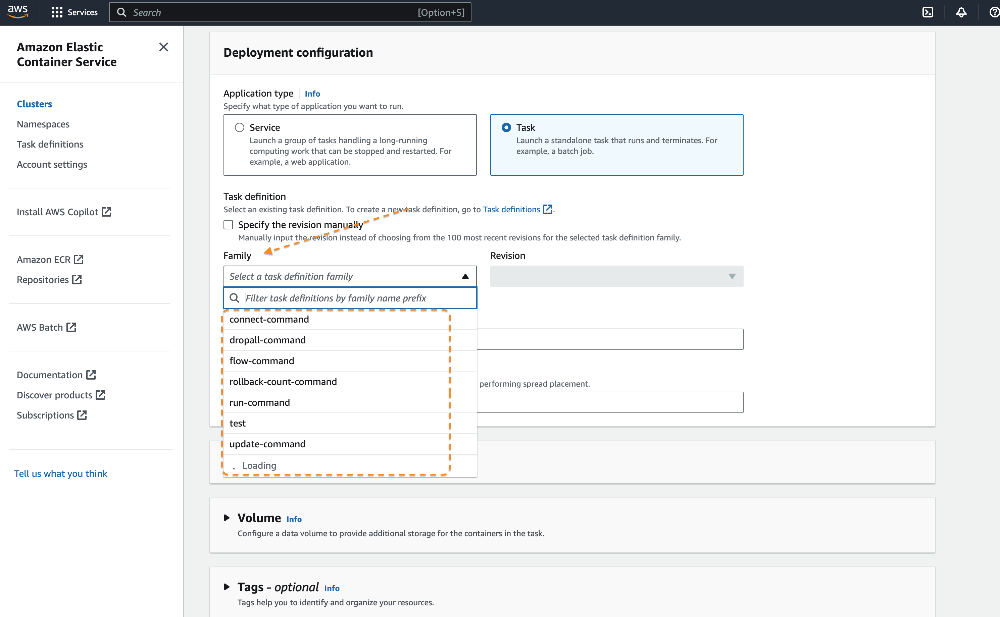
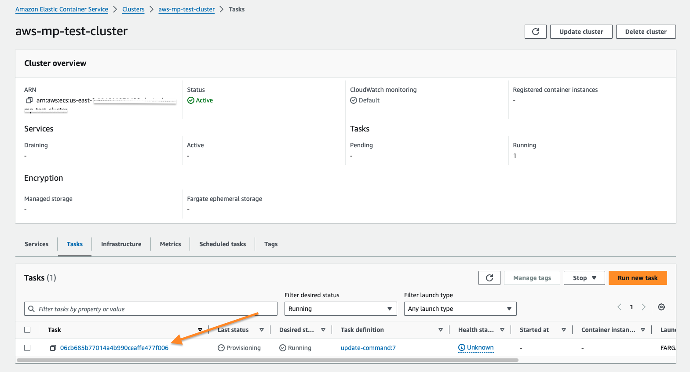
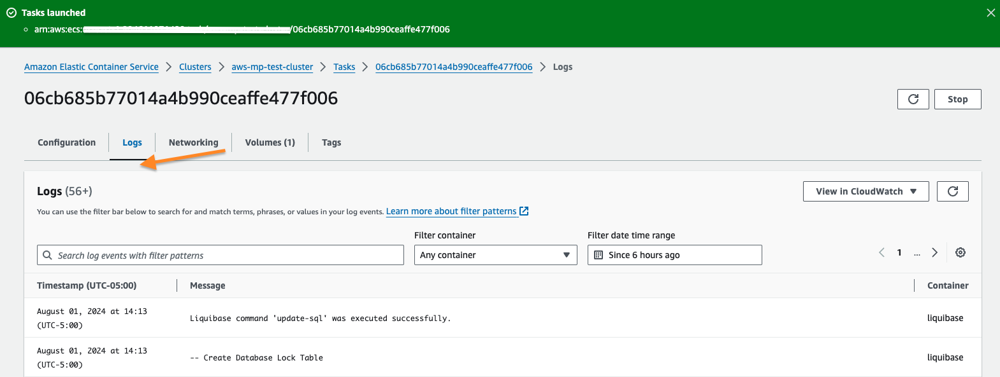

# 📦 Liquibase AWS Marketplace Release Process

This repo ships the Liquibase Secure Docker image, with the AWS License Service
extension installed, to AWS Marketplace listing `prod-l2panlvbozc5e` in the
`LiquibaseAWSMP` account (us-east-1). A new Secure release reaches the listing
in about two hours with no manual steps.

## 🗺️ Release flow


```mermaid
flowchart TD
    A[Dependabot opens a Dockerfile bump PR] --> B[dependabot-sync-and-merge.yml<br/>syncs pom.xml, auto-merges, waits for the merge]
    B --> C[auto-trigger-marketplace-deployment.yml<br/>picks the test tag]
    C --> D[deploy-extension-to-marketplace.yml dry_run=true<br/>builds and submits test-X-run.attempt]
    D --> E{{AWS review, ~30-45 min}}
    E --> F[Poller Lambda, every 15 min<br/>dispatches the ECS tests]
    F --> G[run-task-definitions.yml<br/>tests pass: restrict test version, testStatus=completed]
    G --> H[Poller Lambda<br/>sees the restriction, dispatches production]
    H --> I[deploy-extension-to-marketplace.yml dry_run=false<br/>copies the tested image to tag X and submits it]
    I --> J{{AWS review, ~30-45 min}}
    J --> K[Poller Lambda<br/>confirms X is Public, testStatus=production_released]
```

Production publishes the image that passed the tests, copied by digest, and never
rebuilds it. Marketplace version titles can only be used once, so a bad public
version cannot be replaced under the same name.

### ⏱️ Timing

| Phase | Duration | Component |
|---|---|---|
| Version detection | up to 1 day | Dependabot |
| PR sync, then wait for the merge | ~2 min, plus up to 30 min | `dependabot-sync-and-merge.yml` |
| Build and submit the test image | ~5 min | `deploy-extension-to-marketplace.yml` |
| AWS review of the test version | ~30-45 min | AWS |
| Poller picks it up | 0-15 min | Lambda |
| ECS tests | ~10 min | `run-task-definitions.yml` |
| Restriction of the test version | ~15 min | AWS |
| Poller dispatches production | 0-15 min | Lambda |
| Publish the tested image | ~1 min | `deploy-extension-to-marketplace.yml` |
| AWS review of the public version | ~30-45 min | AWS |
| **Merge to public** | **~2 hours** | |

A sync run waiting 20 minutes on auto-merge is healthy. A release well past two
hours is stuck, and the watchdog will flag it.

## ⚙️ Workflows

| Workflow | Trigger | What it does |
|---|---|---|
| [`dependabot-sync-and-merge.yml`](../.github/workflows/dependabot-sync-and-merge.yml) | Dependabot PR touching `Dockerfile`/`pom.xml` | Syncs `liquibase-secure.version` and `amazon.aws.version` in `pom.xml` to the Dockerfile, pushes those commits as liquibot so the PR checks run, arms auto-merge, waits up to 30 min for the merge (posts to the devops-core Slack channel if it times out), then dispatches the auto-trigger |
| [`auto-trigger-marketplace-deployment.yml`](../.github/workflows/auto-trigger-marketplace-deployment.yml) | Dispatch from the sync workflow, or a push to `main` changing `Dockerfile`/`pom.xml` | Detects the version change and dispatches a dry run with a `test-` tag |
| [`deploy-extension-to-marketplace.yml`](../.github/workflows/deploy-extension-to-marketplace.yml) | Dispatch only | `dry_run=true`: builds, pushes and submits a `test-`/`qa-` image. `dry_run=false`: publishes `tested_image_tag` as the Dockerfile version (see below) |
| [`run-task-definitions.yml`](../.github/workflows/run-task-definitions.yml) | Dispatch from the poller | Runs the ECS test tasks on `aws-mp-test-cluster`; on success restricts the test version and sets `testStatus=completed` |
| [`deploy-marketplace-poller-lambda.yml`](../.github/workflows/deploy-marketplace-poller-lambda.yml) | PR or push to `main` touching `lambda/marketplace-poller/**` | Tests the poller, and on `main` deploys it to `PollMarketplaceChangeSetStatus` |
| [`marketplace-release-watchdog.yml`](../.github/workflows/marketplace-release-watchdog.yml) | Every 2 hours | Fails when a release has been stuck in one state for more than `stall_hours` (default 2) |
| [`sync-amazon-aws-version.yml`](../.github/workflows/sync-amazon-aws-version.yml) | Daily | Opens a PR when `amazon.aws.version` drifts from the AWS SDK in the current Secure release |

Notes on [`dependabot.yml`](../.github/dependabot.yml) (open
[Dependabot PRs](https://github.com/liquibase/liquibase-aws-license-service/pulls/app%2Fdependabot)):

- `com.liquibase:liquibase-commercial` is ignored and synced from the Dockerfile instead, so a Secure bump is always one self-consistent PR.
- `software.amazon.awssdk:*` is ignored because `amazon.aws.version` must match the AWS SDK bundled in the Secure image; a newer SDK breaks the image with a checksum clash. Only the sync workflows change it.
- The sync workflow waits for the merge because everything downstream reads `main`; do not remove the wait.

### 🚢 Production publish (`dry_run=false`)

The poller dispatches it with `validated_version` and `tested_image_tag`. Before
publishing, the job refuses when:

- `validated_version` is not the Dockerfile version on `main`
- `tested_image_tag` is not a `test-` tag of that version
- the tag's DynamoDB row is not `completed`, `production_dispatched` or `production_released`
- the test version is not `Restricted` on the listing

It then copies the tested image to the version tag with
`skopeo copy --all --preserve-digests`, checks the digest, and submits it with
[`submit-aws-mp-listing.sh`](../.github/utils/submit-aws-mp-listing.sh). It skips
the submit when the version is already on the listing, so a re-run is safe.

## 🔁 Poller Lambda

`PollMarketplaceChangeSetStatus` runs every 15 minutes from EventBridge. Source:
[`lambda/marketplace-poller/`](../lambda/marketplace-poller/). Terraform owns its
configuration and CI owns its code, so do not edit it in the console.

Each run:

1. Finds `SUCCEEDED` change sets from the last `LOOKBACK_DAYS` (default 7) for versions titled `test-*`, and dispatches the ECS tests.
2. For `completed` rows, finds the `RestrictDeliveryOptions` change set for that version's delivery options (submitted by [`restrict-aws-mp-listing.sh`](../.github/utils/restrict-aws-mp-listing.sh)). When it has `SUCCEEDED`, it dispatches production and sets `production_dispatched`.
3. Sets `production_released` once the version is Public on the listing.

Only titles **starting with** `test-` are automated. `qa-` and hand-made titles
such as `devopstest-5.2.2` are ignored and must be restricted by hand.

## 🏷️ Test tags

| Tag | Version released |
|---|---|
| `test-5.2.3-482.1` | `5.2.3` (run 482, attempt 1) |
| `test-5.2.3-482.2` | `5.2.3` (retry of the same run) |
| `test-5.2.2-beta-482.1` | `5.2.2-beta` |
| `test-5.2.2` | `5.2.2` (older format) |

## 📊 Release states

Table `liquibase-secure-marketplace-changesets`, field `testStatus`:

| State | Meaning | Watchdog alerts after |
|---|---|---|
| `testing` | ECS tests dispatched | 2h from `createdDate` |
| `completed` | Tests passed, waiting on the restriction | 2h from `testCompletedAt` |
| `on_hold` | Paused by hand; nothing reads it | never |
| `production_dispatched` | Production run dispatched, not yet Public | 2h from `productionTriggeredAt` |
| `production_released` | Public on the listing | never |
| `abandoned` | Will never release; use instead of deleting the row | never |

The watchdog also flags `test-*` versions that are still Public but were never
tracked, which happens when the poller is down longer than `LOOKBACK_DAYS`.

## 🔍 If a release does not appear

1. If the Dependabot bump PR never merged, check its latest commit for runs waiting for approval (`action_required`); approving them runs the checks.
2. Open the latest [watchdog run](https://github.com/liquibase/liquibase-aws-license-service/actions/workflows/marketplace-release-watchdog.yml).
3. Read the poller logs: log group `/aws/lambda/PollMarketplaceChangeSetStatus`.
   - `No restriction change set found yet for <tag>` on repeat: the restriction lookup is not matching.
   - `Failed to trigger workflow: ... 422`: GitHub rejected the dispatch, usually a required input the poller does not send.
4. List the latest change sets:
   ```bash
   aws marketplace-catalog list-change-sets --catalog AWSMarketplace --region us-east-1 \
     --filter-list '[{"Name":"EntityId","ValueList":["prod-l2panlvbozc5e"]}]' \
     --sort '{"SortBy":"StartTime","SortOrder":"DESCENDING"}' --max-results 5
   ```
   AWS rejects a change set while another is in flight on the same product.
5. Check the [deploy runs](https://github.com/liquibase/liquibase-aws-license-service/actions/workflows/deploy-extension-to-marketplace.yml), not just their status:
   - Dry run: grep the log for `buildx failed`. ECR tags are immutable, so pushing an existing tag fails.
   - Production run: look for `✅ <version> is the tested image sha256:…`, or the notice that the version is already on the listing.

## 🧪 Manual testing

### ▶️ ECS tasks on the marketplace image

Run
[`run-task-definitions.yml`](https://github.com/liquibase/liquibase-aws-license-service/actions/workflows/run-task-definitions.yml)
with `image_tag=<tag>`. It registers the `version-command` and
`update-command-dynamodb` task definitions from
[`.github/task-definitions/`](../.github/task-definitions/) with that exact image,
runs them on the `aws-mp-test-cluster` Fargate cluster, and restricts the version
when both pass. It only updates DynamoDB for `test-` tags, so it is safe on a `qa-` tag.

To run a task by hand, ask DevOps for access to the `LiquibaseAWSMP` account.
`run-task` with only a family name runs the latest revision, which may hold a
different image, so pick the revision registered with your image. From the
console: **Tasks**, **Run new task**, pick the **Family** and **Revision**, then
**Create**. Logs are on the task's **Logs** tab.






### 🛠️ QA dry run

To put a build on the listing without releasing it, run
[`deploy-extension-to-marketplace.yml`](https://github.com/liquibase/liquibase-aws-license-service/actions/workflows/deploy-extension-to-marketplace.yml)
with `dry_run=true` and `image_tag=qa-<version>-<n>`. Never use a `test-` tag for
this: the poller would test it and release the version.

Once AWS approves it, the QA version is **public** on the listing. The `qa-`
prefix only keeps it out of the automation, so neither the poller nor the
watchdog will restrict it or flag it. Restrict it yourself: run
[`run-task-definitions.yml`](https://github.com/liquibase/liquibase-aws-license-service/actions/workflows/run-task-definitions.yml)
with the `qa-` tag, which tests it and restricts it on success. If the tests fail,
restrict it anyway with
[`restrict-aws-mp-listing.sh`](../.github/utils/restrict-aws-mp-listing.sh)
(`IMAGE_TAG`, `PRODUCT_ID` and `AWS_REGION` set), then confirm the version shows
`Restricted` on the listing.

### 🐳 Local image

The [`Dockerfile`](../Dockerfile) is `liquibase/liquibase-secure` plus the
extension installed with `lpm`, and sets `DOCKER_AWS_LIQUIBASE=true`.

```bash
docker build -t liquibase-aws-license-service .

# Lists lib/liquibase-aws-license-service-X.Y.Z.jar
docker run --rm liquibase-aws-license-service liquibase --version
docker run --rm liquibase-aws-license-service ls -la /liquibase/lib/

docker run --rm liquibase-aws-license-service liquibase --help
docker run --rm liquibase-aws-license-service env | grep DOCKER_AWS_LIQUIBASE

# Interactive shell
docker run -it --rm liquibase-aws-license-service /bin/bash
```

## ✨ Releasing the extension itself

The `liquibase-aws-license-service` extension is released only when needed. After
a release, Dependabot opens a PR in
[liquibase-package-manager](https://github.com/liquibase/liquibase-package-manager/pulls/app%2Fdependabot)
([example](https://github.com/liquibase/liquibase-package-manager/pull/430/files));
review and merge it by hand so `lpm` can install the new version.
